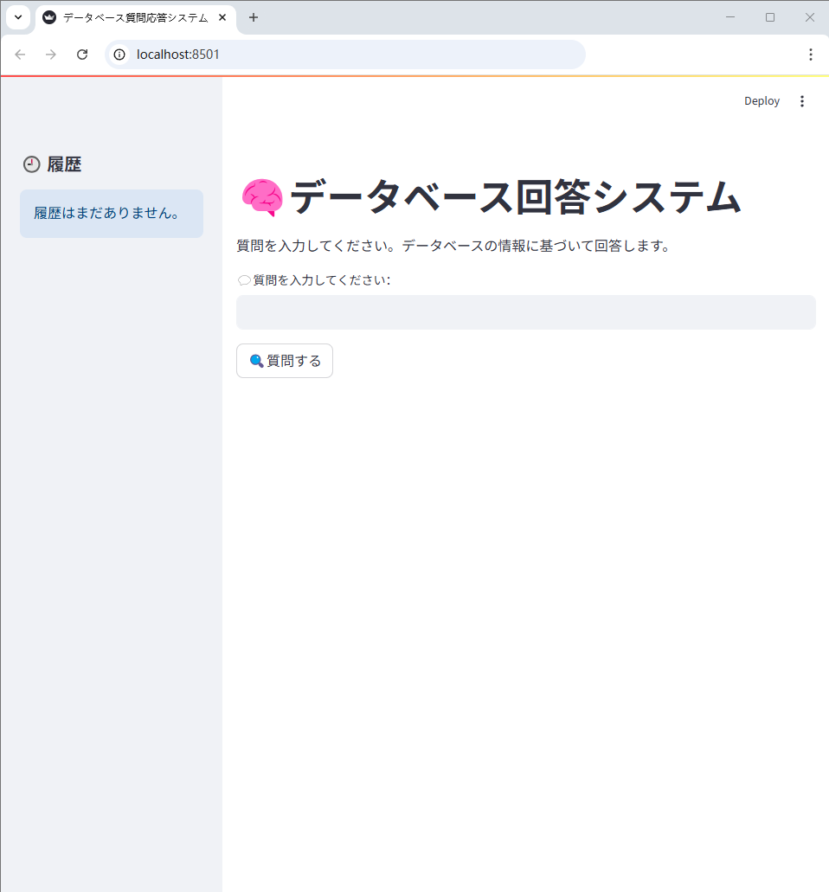
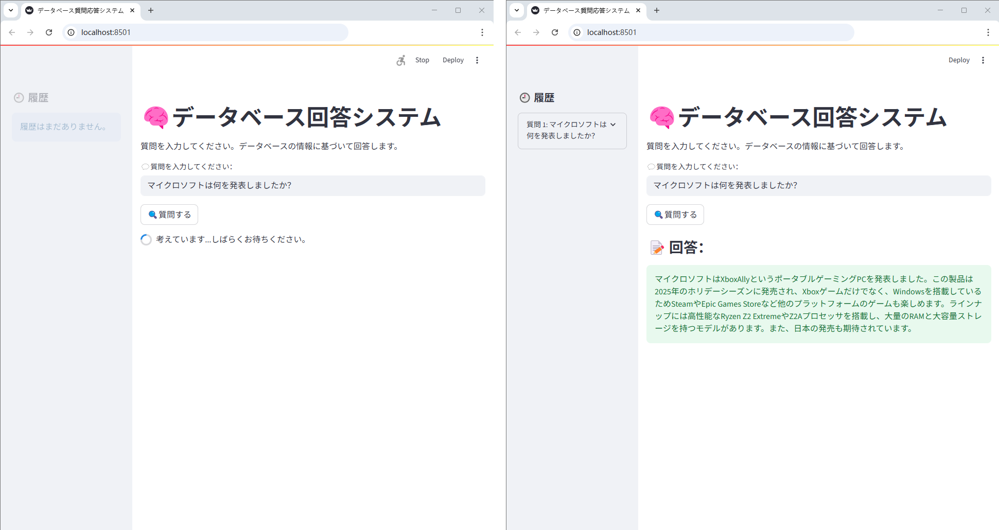

# RAG技術を用いたQAシステム

---

## 1. プロジェクト概要

本プロジェクトは、RAG（Retrieval-Augmented Generation）技術を用いて構築されたQA（質問応答）システムです。  
[Yahooニュース](https://news.yahoo.co.jp/)から取得したニュースをデータベースとして活用し、RAG技術によりその内容を検索・抽出したうえで、[streamlit][streamlit]を用いてユーザーとの対話インターフェースを実現しています。

---

### 結果の表示

下図は本プロジェクトにおける結果例の一つです。  
UI上で質問を入力すると、QAシステムがデータベース内の情報に基づいて回答を生成します。  


---

## 2. プロジェクト構成

<pre>
.
├── RAG/               # RAG関連のLLMや埋め込み処理のコードを格納
├── data/              # データベース用のテキストファイルを保存
├── images/            # READMEに使用する画像ファイル
├── storage/           # ベクトル化処理されたJSON形式のデータベースファイルを保存
├── utils/             # データ処理や関数呼び出しなどのツールコード
├── app.py             # プロジェクトの実行用スクリプト
├── requirements.txt   # Python依存関係リスト
└── README.md          # プロジェクトの説明ドキュメント
</pre>

---

## 3. RAGの構築

### RAG（Retrieval-Augmented Generation）とは？

RAG（検索拡張生成）は、情報検索（Retrieval）とテキスト生成（Generation）を組み合わせたモデル構造であり、  
より高性能で知識に富んだ質問応答システムやチャットボットを構築するために用いられます。  
ユーザーの質問に対して、RAG はまずナレッジベース（知識ベース）から関連する情報を検索（Retrieval）し、  
その検索結果に基づいて回答を生成（Generation）します。  

処理の流れは主に3段階です：  
検索（Retrieve）  
ユーザーからの質問を受け取ると、最初に関連する文書をデータベースやベクトルインデックス、検索エンジンなどを用いて検索します。  

拡張（Augment）  
検索で取得した文書は、質問文とともに生成モデルへの入力（プロンプト）に組み込まれます。  
これにより、モデルは自身の知識に加え、外部情報も活用して回答を生成できます。  

生成（Generate）  
拡張された入力（質問文 + 検索文書）をもとに、生成モデルに入力し、最終的な回答を生成します。  


図像の出典: <https://blog-ja.allganize.ai/allganize_rag-1/>

---

### 言語モデルの設定

本プロジェクトでは、ベクトルデータベースの生成および質問応答の際のベクトルマッチングに用いる埋め込み（embedding）アルゴリズムとして、Google Researchが提案した[E5Embedding][E5Embedding]を採用しています。  
[E5Embedding][E5Embedding]は日本語に対する適応性が高い特徴を持っています。  
また、テキスト生成に使用する大規模言語モデル（LLM）としては、[LlmJp][LlmJp]を使用しています。  
[LlmJp][LlmJp]は日本語に特化した高品質なオープンソースの大規模言語モデルを構築することを目的とし、複数の組織が協力して開発しているプロジェクトです。  
言語モデルの設定は、Hugging FaceのTransformersライブラリを用いてローカル環境にデプロイおよび呼び出しを行っています。  

---

## 4.データ準備および実行の仕組み

まず、データベース用のテキストファイルを`data/`フォルダに配置する必要があります。  
本プロジェクトでは、[Yahooニュース](https://news.yahoo.co.jp/)から一部のニュース記事を抜粋し、以下の図のようにテキスト（.txt）形式で`data/`に保存しています。  


---

データ準備が完了し、RAGシステムを起動した際に、`data/`フォルダ内のデータベーステキストがまだベクトル化されていない場合、  
システムは自動的に埋め込みアルゴリズムを用いてデータベーステキストをベクトル化し、その結果を`storage/`にvector databaseとして保存します。  
その後、RAGシステムの検索（Retrieve）段階では、入力された質問とvector databaseの両方に埋め込みを適用し、  
ベクトルマッチングを行います。マッチング結果は拡張（Augment）フェーズへ入力されます。  

拡張（Augment）におけるプロンプト設定は以下となります。  

```python
PROMPT_TEMPLATE = dict(
    LLMJP_SYSTEM="""あなたはデータベースを参照してユーザーの質問に答えるAIアシスタントです。
            質問に対しては、提供されたデータベースの情報のみを使って回答してください。
            もしデータベースに関係内容がない場合は、知らないと正直に答えてください。
            回答はわかりやすく、自然言語で150文字数以内にお願いします。""",

    LLMJP_PROMPT_TEMPALTE="""以下のデータベースを参考にして、ユーザーの質問に答えてください。        
    　　　　 質問: {question}
            参考用のデータベース：
            ···
            {context}
            ···
            もし上記のデータベースから答えを導き出せない場合は、「データベースにその情報は存在しないため、分かりません」と答えてください。
            有益な回答：""",
)
```

ここで、`LLMJP_SYSTEM`はシステムプロンプトを指し、`LLMJP_PROMPT_TEMPLATE`はアシスタントおよびユーザープロンプトを表します。  
`{question}`は入力された質問を示し、`{context}`は検索（Retrieve）ステップでマッチングされたデータベーステキスト情報を指します。  
拡張（Augment）処理が完了すると、生成されたプロンプトは[LlmJp][LlmJp]に入力され、[LlmJp][LlmJp]が回答を生成して出力します。 

---

## 5. 実行結果

ターミナルで以下のコマンドを入力して実行することで、RAG質問応答システムを起動します。  

```python
streamlit run app.py
```

実行後、ブラウザが自動的にローカルホストのポート `localhost:8501` を開き、[streamlit][streamlit]を用いて構築されたRAG質問応答の画面に遷移します。  



質問入力欄に関連する質問を入力し、「質問する」ボタンをクリックすると、  
一定時間の読み込み後に、RAG質問応答システムがデータベースの内容に基づいて回答を生成します。  



もし質問内容がデータベース内で見つからない場合、RAG質問応答システムは「データベースに関連する回答が存在しない」旨の応答を返します。  


質問応答の履歴は、後で確認しやすいようにウェブ画面の左側にも保存されます。  


---

## 6. まとめと考察

本プロジェクトは、RAGアルゴリズムと[streamlit][streamlit]ツールを用いてローカル環境で動作するRAG質問応答システムを構築しました。  
今後は、以下の改善によりクラウド環境への展開も期待されます。  
- GPTなどのオンラインAPIをLLMとして活用し、ローカルリソースの負荷を軽減する。
- Streamlitアプリケーションをクラウドプラットフォームにデプロイし、パブリックアクセスを可能にする。
- ローカルデータベースの代わりにクラウドストレージを活用し、システムの拡張性と協調性を向上させる。

---

## 7. 付録

- 埋め込み処理ライブラリ：[E5Embedding][E5Embedding]
- 大規模言語モデル（LLM）：[LlmJp][LlmJp]
- ユーザーインターフェース（UI）：[streamlit][streamlit]


[streamlit]: https://github.com/streamlit/streamlit
[E5Embedding]: https://huggingface.co/intfloat/e5-base
[LlmJp]: https://huggingface.co/llm-jp


